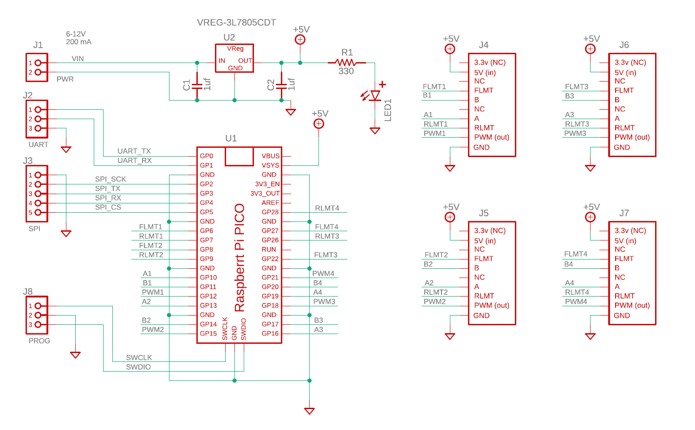
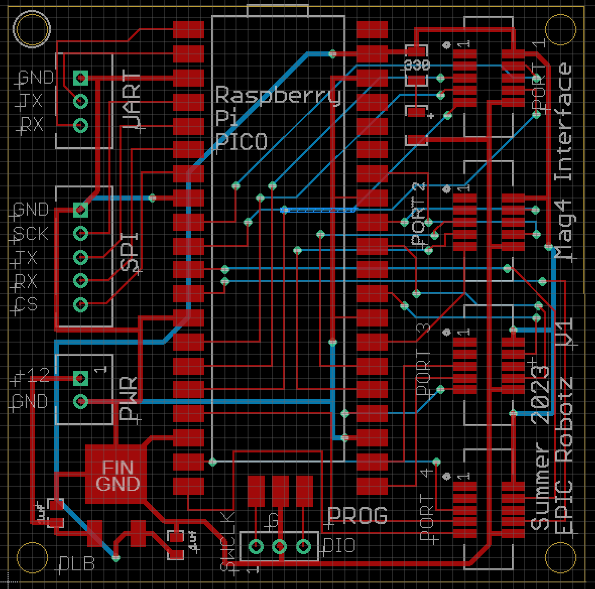

# Mag4 Circuit Board

This respository contains all the Eagle Files necessary to produce
the PCB for the Mag4 Interface.  

Bill of Materials:
    
    1x PCB                      -- From AllPCB 
    1x Raspberry Pi PICO Board  -- From Amazon
    4x 10-Pin Socket            -- DigiKey, 1175-2649-1 
    1x LED, 1206                -- DigiKey, 732-4989-1
    1x VReg 5V 1.5A, DPAK       -- DigiKey, 497
    1x 330 ohm Res, 1206        -- DigiKey, RMCF 1206FT330RCT
    2x Cap Tant, 1 UF, 1206     -- DigiKey, 478-2363
    1x JST male Socket, 2 Pin   -- From Amazon
    1x JST male Socket, 3 Pin   -- From Amazon
    1x JST male Socket, 5 Pin   -- From Amazon
    1x 3-Pin Header, 0.1 Pitch  -- From Amazon

