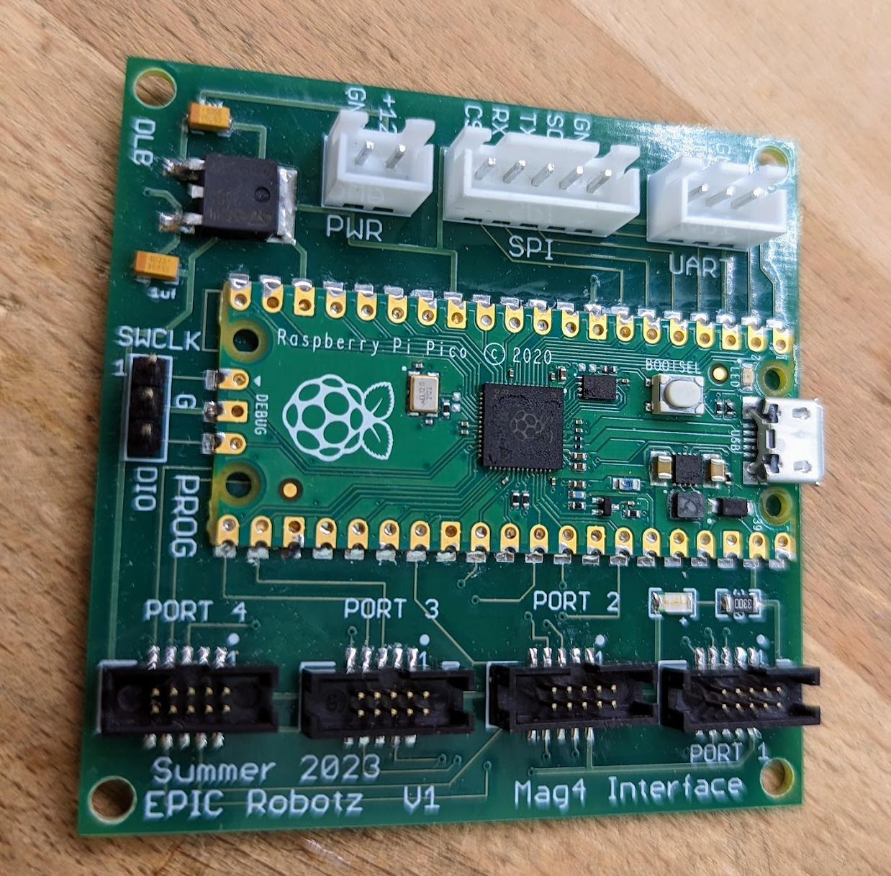

# Mag4 Project -- 4 Way Interface for SRX-MAG Encoders

## Background

The SRX Mag Encoder developed by Cross the Road Electronics (CTRE) has
been a mainstay for FRC Robots for many years.  It provides the ability
to read the angular postion of a shaft and provides two signals: a PWM
signal for abolute angle measurements and a quadrature signal for relative
measurements.  The electrical interface to the device is a socket for
small 10-pin ribbon cable that carries power and signals.  This ribbon
cable is usually connected to a Talon SRX motor controller that has a
mating socket.  Once connected to the Talon, the encoded information can
be read at the RoboRio by way of the CAN bus.  However, CTRE makes other
compatable accessories for this 10-pin cable so that the signals and be
broken out for other interfaces. 

As of 2023, an SRX Mag Encoder costs about $40.00.

Around 2018, CTRE and Vex Robots introduced the Falon Motor which has
a motor control and encoder built in.  That is, a Falcon does not need a Talon.
Without Talons, a SRX Mag Encoder does not have a natural interface device.
To alevate this problem CTRE also introduced a "CANCoder" with is upgrade
to the SRX Mag Encoder.  The CANCoder has the same features as the SRX Mag
Encoder, except that the 10-pin socket has been replaced by CAN wiring.  

As of 2023, a fully decked out CANCoder costs about $80.00.  

## The Problem to be Solved

To build a swerve dirve robot with 4 wheels, 4 shaft encoders are necessary
to sense the direction of the drive wheels.  The built-in encoders in the Falcons
are not really suitable for this job since they do not report absolute 
angles.

In the past, we have used 4 CANCoders connected to a CAN bus to sense the
angle on the wheels.  This works, but with upwards of 30 devices on the CAN
bus -- the CAN bus begins to be over-utilised, leading to unwantted latency
of the resulting data (for all devices on the bus).  Also, 4 CANCoders cost
about twice as much as SRX Encoders.

Our idea is to use the cheaper SRX Encoders and thereby save money and reduce the
relience on the CAN bus.  Also, we may be able to significately reduce data latency.
Finally, we may be able to fuse the PWM signal with the Quadrature in the PICO 
to produce accurate angle measurments that are updated as fast as the quadrature
readings.  (Sadly, as of this writing, this has not been accomplished with the
required robustness for compentition.)

## Introducing the Mag4 Interface Device

We created a device, picture below, that has four 10-pin sockets to connect to
4 SRX Mag Encoders, and also a SPI port to connect to the RoboRio.  The device
is powered by 12 volts from the robot's Power Distribution Panel. 

The heart of the device is a Raspberry PICO board.  Software for the PICO and the
RoboRio is provided for an end-to-end solution of reading angular data from 4
devices at once and using the data in the RoboRio.  

This respository contains all facets of this project: Software for the PICO, Software
for the RoboRio, schematics and fabrication documents for the circuit board, as well as,
the documentation produced.

In addition, a sophicated test setup was built with a stepping motor that could
accurately rotate a shaft to known positions.  Data for this test station is also 
included in this respository.

