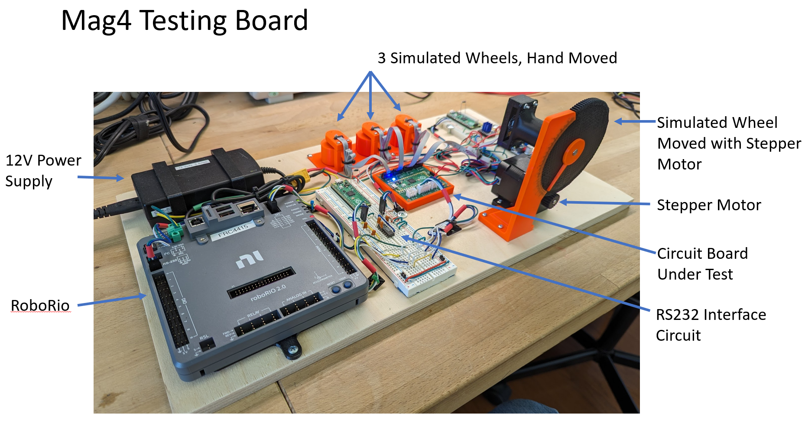
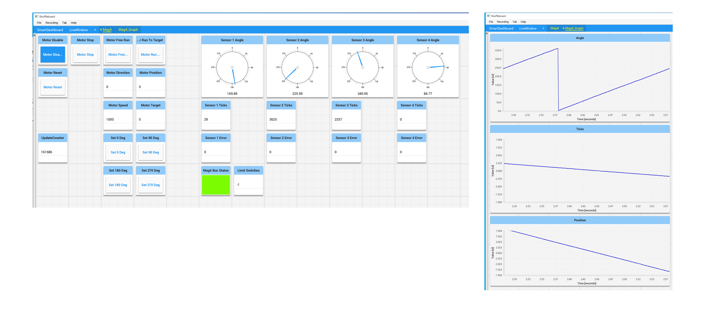

# Mag4 Test Setup

To test the Mag4 device under conditions it is likely to see on a FRC robot, a 
test board, pictured below was constructed.  

The board features a RoboRio that interfaces with a Mag4 device.  The Mag4
is connected to 4 SRX Mag Encoders.  Three of the encoders are mounted on
shafts that can be freely rotated by hand. The forth is mounted to a shaft
that can be precisely positioned by a stepper motor.

The RoboRio can control the stepper motor via it's RS232 interface. The RS232
signals are converted to TTL level signal in the center of the board, and
then routed to a PICO that controls the stepper motor.

Normal FRC Java Software was developed to control the stepper motor and 
display the signals from the Mag4 device.

 